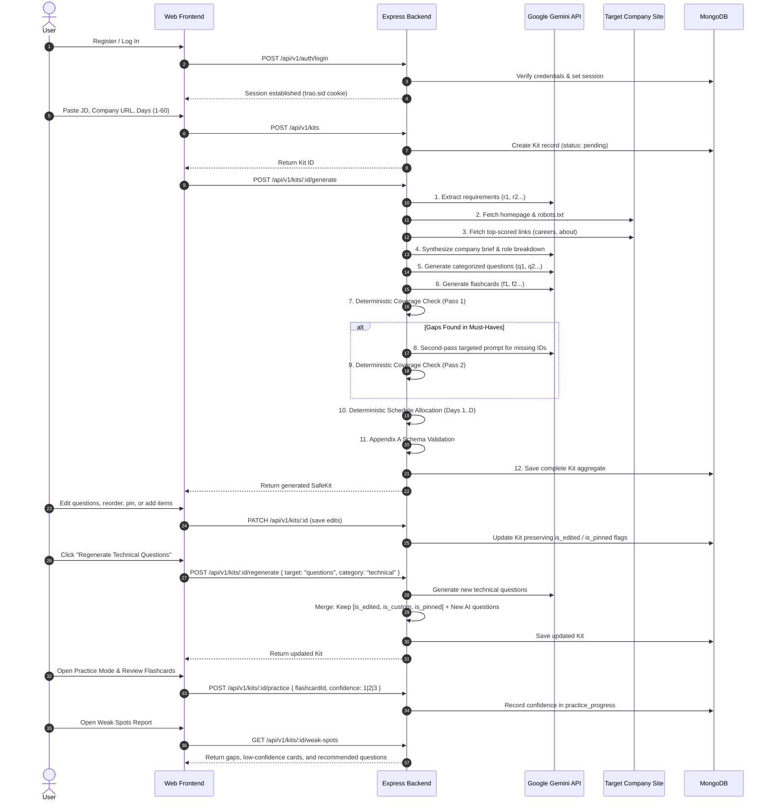

# Trao AI Interview Prep Kit

A full-stack, AI-powered interview preparation platform and automated evaluation system that transforms raw job descriptions, company URLs, and interview timelines into structured, personalized, and pedagogically rigorous preparation kits.

---

## 1. Project Title
**Trao AI Interview Prep Kit** — Full-Stack Engineering Assessment

---

## 2. Project Overview
Trao AI Interview Prep Kit is an end-to-end web application and headless evaluation pipeline designed to eliminate generic, superficial interview preparation. By synthesizing raw job description text with live company research gathered via a safe, heuristic web crawler, the system extracts structured role requirements, generates targeted multi-category interview questions and flashcards, deterministically enforces 100% must-have requirement coverage, and mathematically distributes study sessions across a candidate's available preparation timeline ($1$ to $60$ days). The application includes an interactive kit builder that preserves custom user edits during targeted section regeneration, a spaced-repetition flashcard practice mode, an algorithmic weak spots diagnostic report, and a headless CLI batch evaluator conforming to the assessment's strict Appendix B specification.

---

## 3. Problem Statement & Purpose
Preparing for technical and behavioural interviews is often fragmented, generic, and unguided:
- Candidates struggle to dissect lengthy, ambiguous job descriptions into actionable technical, behavioural, and domain competencies.
- Preparation questions found online lack alignment with the specific hiring company's products, engineering culture, or public interview processes.
- Candidates lack deterministic verification that their study plan covers every mandatory requirement without blind spots.
- Study plans rarely adapt dynamically to the candidate's actual preparation window or allow fine-grained customization without losing progress upon refresh or regeneration.

Trao solves this by establishing a verifiable, explainable preparation pipeline that pairs targeted LLM generation with deterministic application code rules—ensuring guaranteed requirement coverage, mathematical schedule allocation, edit preservation, and active practice tracking.

---

## 4. Key Features
- **Deterministic Requirement Extraction**: Parses unstructured JD text to extract categorized competencies (`technical`, `behavioural`, `domain`) prioritized as `must` vs. `nice`, assigning sequential stable identifiers (`r1`, `r2`, ...).
- **Robots-Compliant Company Crawler**: Crawls company homepages, scores and follows high-value internal links (`careers`, `about`, `engineering`, `culture`), and extracts interview insights while enforcing strict Server-Side Request Forgery (SSRF) boundary defenses.
- **Categorized Question & Flashcard Generation**: Generates pedagogical questions with comprehensive answer outlines across four distinct categories (`technical`, `behavioural`, `system-design`, `company-fit`) along with active-recall flashcards.
- **Pure Arithmetic Coverage Engine**: Uses code-level set subtraction (`must_requirements \ covered_requirements`) to detect gaps, automatically executing a targeted second-pass generation loop to guarantee 100% must-have coverage.
- **Deterministic Mathematical Scheduler**: Allocates questions across $1$ to $60$ days, placing foundational and complex topics early, scheduling review and fit later, and calculating precise preparation minutes based on question difficulty.
- **Interactive Kit Builder with Edit Preservation**: Allows candidates to edit questions, answer outlines, flashcards, and company briefs; reorder questions; move questions between categories; and pin questions. Targeted section regeneration replaces only unedited AI questions while preserving all user-modified, custom, or pinned items.
- **Flashcard Practice Mode**: Provides an interactive flip-card study interface with confidence scoring (`1: Needs Work`, `2: Solid`, `3: Strong`) and study history tracking stored separately from the core kit aggregate.
- **Algorithmic Weak Spots Diagnostic (Creative Feature)**: Analyzes preparation state to surface unattempted questions, low-confidence flashcards, and sub-2.0 average confidence areas with prioritized question recommendations.
- **Headless Batch Evaluator CLI**: Runs the identical core generation pipeline headlessly across batch test cases with complete failure isolation, producing a single JSON artifact conforming strictly to Appendix B.

---

## 5. Assessment Requirements Implemented

### Automated Evaluation (55 Points)
- **Requirement Extraction (20 pts)**: Correctly identifies competencies from the JD, distinguishes `must` vs. `nice`, categorizes into `technical`/`behavioural`/`domain`, assigns stable IDs (`r1`, `r2`), and honestly reflects thin JDs without inventing requirements.
- **Coverage + Schedule (15 pts)**: Deterministic code guarantees all must-have requirements have question coverage. Uncovered items trigger a genuine second-pass generation loop. Generates exactly $D$ days ($1 \le D \le 60$), prioritizing must-haves early with integer minute sums.
- **Research + Sequencing (10 pts)**: Crawls company websites, scores internal links, discovers hiring information, and queries public interview patterns. Generates questions separately by category and requirement.
- **Robustness (10 pts)**: Handles unreachable websites, 404s, timeouts, missing hiring pages, thin JDs, rate limits (exponential backoff with jitter), 1-day/60-day schedule boundaries, and enforces strict Appendix A schema validation. In batch mode, individual case failures are isolated and never abort the run.

### Human Review (45 Points)
- **Builder (15 pts)**: Full editing for questions, answer outlines, flashcards, and company brief. Supports adding, deleting, reordering, and moving categories. Preserves dirty (`is_edited`), custom (`is_custom`), and pinned (`is_pinned`) items during section regeneration.
- **Interaction Design (10 pts)**: Responsive design across desktop, tablet, and mobile; clear stage-by-stage generation progress indicators; empty and error states; keyboard accessible; instantaneous local state updates.
- **Code Quality & Architecture (10 pts)**: Clean separation of concerns, strict TypeScript types, robust error handling, comprehensive test suites, and thorough documentation.
- **Practice Mode & Weak Spots (10 pts)**: Active recall flashcards with confidence ratings, session history tracking, and an algorithmic diagnostic report highlighting high-risk knowledge gaps.

---

## 6. Architecture Overview

The system strictly enforces separation of concerns between user-facing presentation, business orchestration, deterministic rule engines, external crawling, and persistence.

```text
┌────────────────────────────────────────────────────────┐
│                   User Interfaces                      │
│   Web UI (React 18 + Vite) │   CLI Batch Runner        │
│   (Interactive Builder,    │   (npm run evaluate)      │
│    Practice Mode)          │                           │
└──────────────┬─────────────┴───────────┬───────────────┘
               │ HTTP REST               │ CLI Execution
               ▼                         │
┌────────────────────────────────────────┼───────────────┐
│              Backend API Layer         │               │
│   - Auth Controller & Session Guard    │               │
│   - Kits Controller (CRUD + Slices)    │               │
│   - Practice Controller                │               │
└──────────────┬─────────────────────────┘               │
               ▼                                         │
┌────────────────────────────────────────────────────────▼┐
│               Core Application Pipeline                 │
│                                                         │
│   1. Input Validation (Length, URL, Days bounds)        │
│   2. Requirement Extraction (LLM -> Stable r1, r2 IDs)  │
│   3. Heuristic Crawler & Link Ranker (Cheerio/HTTP)     │
│   4. Public Interview Insights Scanner                  │
│   5. Company Brief & Role Synthesizer (LLM)             │
│   6. Categorized Question Generation (LLM Staged)       │
│   7. Flashcard Generation (LLM)                         │
│   8. Deterministic Coverage Engine (Code Set Math)      │
│   9. Second-Pass Gap Closure Loop (Targeted LLM)        │
│  10. Deterministic Schedule Allocator (Math/Heuristics) │
│  11. Strict Appendix A Schema Validator (Zod)           │
└──────────────┬──────────────────────────────────────────┘
               ▼
┌────────────────────────────────────────────────────────┐
│                  Persistence Layer                     │
│   MongoDB Database (Native Driver)                     │
│   - users collection (bcrypt credentials)              │
│   - kits collection (atomic Appendix A aggregate)      │
│   - practice_progress collection (spaced repetition)   │
│   - sessions collection (connect-mongo store)          │
└────────────────────────────────────────────────────────┘
```

### Component Breakdown
- **Frontend**: React 18 SPA built with Vite and TypeScript. Features Vanilla CSS design tokens (zero heavy CSS framework bloat), client-side routing via React Router DOM, centralized API client handling session credentials, and responsive layouts.
- **Backend**: Node.js and Express 4 service written in TypeScript. Implements session authentication via `connect-mongo`, route controllers, centralized error handling, and strict input validation.
- **MongoDB**: Utilizes the official MongoDB native driver (`mongodb` v6). Uses an embedded document strategy for Kits to guarantee atomic updates and zero-join serialization, with separate collections for `users`, `sessions`, and `practice_progress`.
- **LLM Integration**: Communicates with the Google Gemini API (`gemini-3.5-flash-lite` production model) via direct REST endpoints with exponential backoff, jitter, and prompt delimiters isolating untrusted data.
- **Crawler / Research Flow**: Heuristic crawler using `cheerio` to parse HTML. Follows `robots.txt`, scores internal URLs by relevance (`careers`, `about`, `engineering`), caps page downloads (1.5MB max) and text extraction (8,000 chars max), and protects against SSRF.
- **Coverage Engine**: Pure deterministic code comparing must-have requirement IDs against question reference lists. Triggers a second-pass generation prompt only if must-have gaps exist.
- **Schedule Engine**: Pure deterministic code mathematically distributing questions across $D$ days ($1 \le D \le 60$), calculating preparation minutes per day based on difficulty ($1=15\text{m}$, $2=25\text{m}$, $3=45\text{m}$).
- **Validation**: Strict runtime validation enforcing Appendix A top-level keys, type constraints, and referential integrity between questions, flashcards, requirements, and schedule days.
- **Practice Mode**: Isolated practice tracking storing card confidence (`1: Needs Work`, `2: Solid`, `3: Strong`) and review timestamps without mutating the core Kit aggregate.
- **Batch Evaluator**: Headless runner executing the identical pipeline across test cases from the command line, formatting results into Appendix B JSON with per-case failure isolation.

---

## 7. End-to-End Workflow



---

## 8. Tech Stack
The repository uses the following verified technologies:

### Backend
- **Runtime**: Node.js (v20+ / v22 recommended)
- **Framework**: Express 4 (`express` v4.21.2)
- **Language**: TypeScript 5 (`typescript` v5.7.3), executed via `tsx`
- **Database Driver**: MongoDB Native Driver (`mongodb` v6.13.0)
- **Session Store**: `express-session` (v1.18.1) + `connect-mongo` (v5.1.0)
- **Authentication**: `bcryptjs` (v2.4.3)
- **Web Scraping**: `cheerio` (v1.2.0)
- **Network & SSRF Security**: `ipaddr.js` (v2.5.0), Node.js native `fetch`
- **CORS**: `cors` (v2.8.6)
- **Testing**: `vitest` (v2.1.8)

### Frontend
- **Framework**: React 18 (`react` v18.3.1, `react-dom` v18.3.1)
- **Build Tool**: Vite 6 (`vite` v6.0.1) with `@vitejs/plugin-react`
- **Language**: TypeScript 5 (`typescript` v5.7.2)
- **Routing**: React Router DOM 6 (`react-router-dom` v6.28.0)
- **Styling**: Vanilla CSS with custom CSS variables / design tokens
- **Testing**: `vitest` (v2.1.8), `@testing-library/react` (v16.3.3), `@testing-library/jest-dom` (v7.0.1), `jsdom` (v29.1.1)

### External Services
- **AI / LLM**: Google Gemini API via REST (`gemini-3.5-flash-lite`)
- **Hosting / Deployment**: Render (Web Service for backend, Static Site for frontend)

---

## 9. Repository Structure

```text
trao-ai-interview-prep/
├── .env.example                  # Backend environment variable template
├── .gitignore                    # Root git ignore rules
├── PLAN.md                       # Master implementation plan & phase tracker
├── README.md                     # Comprehensive project documentation
├── package.json                  # Root scripts (evaluate, test orchestration)
│
├── backend/                      # Express + TypeScript backend service
│   ├── .env.example              # Backend local environment template
│   ├── package.json              # Backend dependencies and scripts
│   ├── tsconfig.json             # Backend TypeScript configuration
│   └── src/
│       ├── app.ts                # Express application factory & middleware setup
│       ├── server.ts             # Server entrypoint, DB connection, graceful shutdown
│       ├── evaluate.ts           # Headless Batch Evaluator CLI (npm run evaluate)
│       ├── config/               # Environment loader (env.ts) and session config (session.ts)
│       ├── controllers/          # Route handlers (auth, kit, practice, weak-spots)
│       ├── db/                   # MongoDB connection, index management, collections
│       ├── middleware/           # Auth guard, error handling, not found middleware
│       ├── routes/               # API route definitions (auth, kit, health)
│       ├── services/             # Core business logic:
│       │   ├── pipeline/         # Unified generation pipeline (shared with CLI)
│       │   ├── crawler/          # Heuristic scraper, link ranker, robots parser, SSRF validator
│       │   ├── llm/              # Gemini API client with rate limiting & exponential backoff
│       │   ├── prompts/          # Staged prompts (extraction, company, questions, flashcards)
│       │   ├── coverage/         # Deterministic requirement coverage checker
│       │   ├── schedule/         # Deterministic mathematical schedule allocator
│       │   ├── regeneration/     # Edit/pin preservation merge engine
│       │   ├── validation/       # Appendix A schema validator
│       │   ├── practice/         # Flashcard study state service
│       │   └── weak-spots/       # Diagnostic report engine
│       ├── types/                # TypeScript interfaces (kit, api, user, batch)
│       └── utils/                # Sanitizers, logger, SSRF helpers
│
├── frontend/                     # React 18 + Vite frontend SPA
│   ├── .env.example              # Frontend environment template
│   ├── package.json              # Frontend dependencies and scripts
│   ├── tsconfig.json             # Frontend TypeScript configuration
│   ├── vite.config.ts            # Vite configuration and dev proxy
│   ├── public/
│   │   └── _redirects            # SPA client-side routing rules for Render
│   └── src/
│       ├── main.tsx              # React DOM entrypoint
│       ├── app/                  # App shell and React Router route definitions
│       ├── components/           # Reusable UI components (Navbar, ProtectedRoute, Toast)
│       ├── layouts/              # Main layout wrapper
│       ├── pages/                # Screen views:
│       │   ├── HomePage.tsx      # Landing page
│       │   ├── LoginPage.tsx     # Sign in form
│       │   ├── RegisterPage.tsx  # Sign up form
│       │   ├── DashboardPage.tsx # Kit listing and creation trigger
│       │   ├── CreateKitPage.tsx # New kit input form (JD, URL, Days)
│       │   ├── GenerationPage.tsx# Real-time multi-stage pipeline progress view
│       │   ├── KitPage.tsx       # Comprehensive Kit view (tabs: Overview, Questions, Schedule)
│       │   ├── KitBuilderPage.tsx# Interactive editor (edit, reorder, pin, regenerate)
│       │   ├── PracticePage.tsx  # Interactive flashcard practice with confidence rating
│       │   └── WeakSpotsPage.tsx # Diagnostic report highlighting preparation gaps
│       ├── services/             # Frontend API client and endpoints (auth, kits)
│       ├── styles/               # Global CSS tokens and component styles
│       └── types/                # Frontend TypeScript type declarations
│
├── shared/                       # Shared contracts
│   └── contracts/
│       └── kit.schema.ts         # Strict Appendix A & B schema definitions
│
├── cases/                        # Evaluation test cases
│   └── test-cases.json           # Sample test cases for batch evaluation
│
├── docs/                         # Detailed architectural specifications
│   ├── API.md                    # REST API endpoints and payload schemas
│   ├── ARCHITECTURE.md           # System design, boundaries, and trade-offs
│   ├── BATCH.md                  # Batch evaluation CLI specification
│   ├── DATABASE.md               # MongoDB schemas, embedding strategy, and indexes
│   ├── ERRORS.md                 # Error taxonomy, status codes, and edge case handling
│   ├── PIPELINE.md               # Detailed 16-step generation pipeline specification
│   ├── SECURITY.md               # Security architecture, SSRF, XSS, and threat model
│   └── STATE.md                  # Edit and pin state preservation merge algorithm
│
└── results/                      # Output directory for evaluation results (.gitignore)
```

---

## 10. Local Prerequisites
Before running the application locally, ensure you have:
- **Node.js**: Version `v20.0.0` or higher (tested with `v22.x`).
- **npm**: Version `v10.0.0` or higher.
- **MongoDB**: A running local MongoDB instance (e.g. `mongodb://127.0.0.1:27017`) or a MongoDB Atlas connection string.
- **Google Gemini API Key**: A valid Gemini API key from [Google AI Studio](https://aistudio.google.com/).

---

## 11. Installation Steps

Clone the repository and install dependencies in all workspaces:

```bash
# 1. Clone the repository
git clone <repository-url>
cd trao-ai-interview-prep

# 2. Install backend dependencies
cd backend
npm install

# 3. Install frontend dependencies
cd ../frontend
npm install

# 4. Return to root directory
cd ..
```

---

## 12. Environment Configuration

The application requires configuration via environment variables.

### Backend Environment Configuration
Create a `.env` file in the project root (or inside `backend/.env`):

```bash
cp .env.example .env
```

Configure the variables as described below:

| Variable | Description | Default / Example | Required in Production |
| :--- | :--- | :--- | :---: |
| `PORT` | HTTP port for the Express backend server. | `5000` | No (defaults to 5000 or provider `$PORT`) |
| `HOST` | Network interface binding. | `0.0.0.0` | No |
| `NODE_ENV` | Application environment (`development`, `production`, `test`). | `development` | Yes |
| `DATABASE_URL` | MongoDB connection URI. | `mongodb://127.0.0.1:27017/trao_interview_prep` | **Yes** |
| `SESSION_SECRET`| Cryptographically secure random string for signing session cookies. | `change-this-to-a-secure-random-secret` | **Yes** |
| `LLM_API_KEY` | Google Gemini API key used for generation and synthesis. | `AIzaSy...` | **Yes** |
| `GEMINI_MODEL` | Active Gemini model identifier. | `gemini-3.5-flash-lite` | No |
| `FRONTEND_URL` | Public origin of the frontend web application (for CORS). | `http://localhost:5173` | **Yes** (in production) |

> [!CAUTION]
> Never commit `.env` files containing live API keys, database credentials, or production session secrets to version control.

### Frontend Environment Configuration
Create a `.env` file in `frontend/.env` (optional in local development):

```bash
cp frontend/.env.example frontend/.env
```

| Variable | Description | Default / Example | Required in Production |
| :--- | :--- | :--- | :---: |
| `VITE_API_BASE_URL` | Full URL to the backend API. In development, leave blank to use the Vite proxy (`/api/v1`). | `https://trao-ai-interview-prep.onrender.com/api/v1` | **Yes** (in production) |

---

## 13. Local Development Commands

To run the application locally, open two terminal windows:

### Terminal 1: Backend Service
```bash
cd backend
npm run dev
```
*The backend starts at `http://localhost:5000`. It automatically connects to MongoDB, creates required indexes, and watches for file changes using `tsx`.*

### Terminal 2: Frontend Web App
```bash
cd frontend
npm run dev
```
*The frontend development server starts at `http://localhost:5173`. Requests to `/api` are automatically proxied to `http://localhost:5000`.*

---

## 14. Database Setup & Migrations
The application uses MongoDB native driver collections. There are no manual migration scripts required:
- When the backend starts (`backend/src/server.ts`), it automatically executes `ensureUserIndexes()` and `ensureKitIndexes()`.
- Unique indexes on `users.email` and compound indexes on `kits.userId` and `practice_progress` are ensured deterministically on boot.
- If using MongoDB Atlas, ensure your cluster network access allowlist includes your current IP address (or `0.0.0.0/0` for cloud deployment).

---

## 15. Testing & Verification Commands

The repository contains automated unit, integration, and verification test suites.

### Run All Tests (Root)
```bash
# Runs backend tests followed by frontend tests
npm test
```

### Backend Tests
```bash
# Run backend test suite (Vitest)
npm run test:backend

# Or from the backend directory:
cd backend
npm test

# Run tests in watch mode:
npm run test:watch

# TypeScript typechecking:
npm run typecheck

# Production build test:
npm run build
```

### Frontend Tests
```bash
# Run frontend test suite (Vitest + React Testing Library)
npm run test:frontend

# Or from the frontend directory:
cd frontend
npm test

# TypeScript typechecking:
npm run typecheck

# Production build test:
npm run build
```

---

## 16. Mandatory Batch Evaluator

The assessment mandates a headless batch evaluation command that runs the exact same retrieval, generation, coverage, and scheduling pipeline headlessly across an array of test cases.

### Exact Supported Command:
```bash
npm run evaluate -- --input ./cases/test-cases.json --output ./results/kits.json
```

### Batch Evaluator Operation & Guarantees:
- **Zero Duplicate Logic**: Invokes the exact same `executeKitPipeline()` function that powers the web application.
- **Strict Appendix B Compliance**: Produces a single JSON output file conforming to the required `BatchOutputStructure`:
  ```json
  {
    "version": "1.0",
    "generated_at": "2026-09-21T12:00:00.000Z",
    "kits": [
      {
        "id": "case-01-backend-engineer",
        "status": "ok",
        "kit": { ... },
        "error": null
      }
    ]
  }
  ```
- **Failure Isolation**: Each test case is wrapped in an isolated boundary with a deterministic 120-second timeout. If a single case fails (e.g. invalid URL, network timeout), that case is recorded with `"status": "failed"`, and the evaluator **continues immediately** to subsequent cases.
- **Credential Redaction**: All error outputs in the batch result are scrubbed of API keys, Bearer tokens, and database connection credentials.
- **Local Test Server Support**: Automatically resolves relative links (`/about`, `../careers`) and supports local test servers (`http://localhost:*`, `http://127.0.0.1:*`) when evaluated in non-production modes.

---

## 17. Security Architecture

The application implements defense-in-depth security across all layers (see [docs/SECURITY.md](file:///d:/A%20PROJECT/Trao%20Assesment/trao-ai-interview-prep/docs/SECURITY.md) for full threat model):

1. **Authentication & Password Security**: Passwords require a minimum of 8 characters and are cryptographically hashed using `bcryptjs` with salted rounds. Passwords are never stored in plaintext or returned in responses.
2. **Session Security**: Managed server-side in MongoDB via `connect-mongo` with `HttpOnly: true`, `SameSite: strict` (in production), and `Secure: true` (over HTTPS).
3. **Authorization & IDOR Defense**: User ownership is enforced directly at the MongoDB query level (`{ _id: kitId, userId }`). Attempting to access another user's kit returns `404 KIT_NOT_FOUND` to avoid leaking the existence of resource IDs.
4. **Server-Side Request Forgery (SSRF) Protection**: The crawler resolves DNS and checks IP addresses using `ipaddr.js` to block loopback (`127.0.0.0/8`), private subnets (RFC 1918), and cloud metadata endpoints (`169.254.169.254`). Redirects are inspected individually before following.
5. **Cross-Site Scripting (XSS) Prevention**: The frontend contains **zero** occurrences of `dangerouslySetInnerHTML` and zero raw `.innerHTML` assignments. All dynamic strings are rendered through React's native text escaping.
6. **Prompt Injection Mitigation**: All external text (JDs, scraped website pages) is demarcated within distinct XML tags (`[START UNTRUSTED...]`) and treated strictly as data, with system prompts forbidding the LLM from executing embedded instructions.
7. **SafeKit Public Boundary**: Internal builder metadata (`is_custom`, `is_edited`, `is_pinned`, `order`, `crawled_pages`) is stripped by serializer functions before returning kits to API consumers or the batch evaluator.
8. **Centralized Error Sanitization**: Express error middleware intercepts all exceptions and sanitizes output, stripping database connection strings, passwords, and file paths.

---

## 18. Production Deployment

The application is deployed to production using **Render**:

| Service | Component | Production URL |
| :--- | :--- | :--- |
| **Backend API** | Node.js Web Service | `https://trao-ai-interview-prep.onrender.com` |
| **Backend Health** | Health Endpoint | `https://trao-ai-interview-prep.onrender.com/health` |
| **Frontend UI** | Static Site (SPA) | `https://trao-ai-interview-prep-frontend.onrender.com` |

### Deployment Configuration
- **Backend (Render Web Service)**:
  - Root Directory: `backend`
  - Build Command: `npm install && npm run build`
  - Start Command: `npm run start` (executes `node dist/server.js`)
  - Health Check Path: `/health` (returns `{ status: "ok", database: "connected" }`)
  - Environment Variables configured: `NODE_ENV=production`, `DATABASE_URL`, `SESSION_SECRET`, `LLM_API_KEY`, `GEMINI_MODEL`, `FRONTEND_URL`.
- **Frontend (Render Static Site)**:
  - Root Directory: `frontend`
  - Build Command: `npm install && npm run build`
  - Publish Directory: `dist`
  - Client-Side Routing: Configured via `frontend/public/_redirects` (`/*    /index.html   200`).
  - Environment Variables configured: `VITE_API_BASE_URL=https://trao-ai-interview-prep.onrender.com/api/v1`.

---

## 19. Clean-Clone & Reproducibility Instructions

To verify the project from a clean machine:

```bash
# 1. Clone the repository
git clone <repo-url> clean-trao
cd clean-trao

# 2. Setup environment variables
cp .env.example .env
# Edit .env and supply your DATABASE_URL and LLM_API_KEY

# 3. Install all dependencies
npm --prefix backend install
npm --prefix frontend install

# 4. Verify code builds and passes all automated tests
npm test

# 5. Run the mandatory batch evaluation command
npm run evaluate -- --input ./cases/test-cases.json --output ./results/kits.json

# 6. Verify that results/kits.json was generated and contains valid Appendix B kits
cat ./results/kits.json
```

---

## 20. Example Workflow for a Reviewer

A reviewer can experience the entire application workflow in under 5 minutes:

1. **Access Application**: Open the deployed frontend URL (`https://trao-ai-interview-prep-frontend.onrender.com`) or run locally at `http://localhost:5173`.
2. **Register**: Click **"Sign Up"** and create an account (e.g. `reviewer@example.com` / `ReviewerPass123!`).
3. **Create a Kit**:
   - Click **"Create Kit"**.
   - Input:
     - **Job Description**: Paste a technical job description (e.g. Senior Backend Engineer with Node.js, TypeScript, Distributed Systems).
     - **Company URL**: `https://posthog.com` (or any public tech company).
     - **Days Available**: `5`.
   - Click **"Generate Interview Kit"**.
4. **Observe Real-Time Pipeline**:
   - Watch the multi-stage progress indicators update through extraction, crawling, synthesis, question generation, coverage check, and schedule allocation.
5. **Explore Generated Kit**:
   - Review the **Company Brief** with verified source links.
   - Inspect the **Role Breakdown** with stable requirement IDs (`r1`, `r2`...) marked as `must` or `nice`.
   - Check the **Questions** tab: questions are categorized into `technical`, `behavioural`, `system-design`, and `company-fit`.
   - Check the **Schedule** tab: questions are mathematically distributed across 5 days with estimated minutes.
6. **Test the Interactive Builder**:
   - Click **"Open Kit Builder"**.
   - Edit a question's prompt or answer outline (it is flagged as edited).
   - Pin a critical question by clicking the pin icon.
   - Add a custom question by clicking **"Add Question"**.
   - Click **"Regenerate Technical Questions"** and observe that your edited, pinned, and custom questions are preserved while untouched AI questions refresh.
7. **Test Practice Mode**:
   - Click **"Practice Flashcards"**.
   - Click a card to flip and reveal the answer.
   - Rate your confidence (`Needs Work`, `Solid`, `Strong`).
   - Notice cards update your study progress.
8. **View Weak Spots Report**:
   - Click **"Weak Spots"** in the navigation bar.
   - View the diagnostic report highlighting low-confidence flashcards, unreviewed items, and prioritized question recommendations.
9. **Test Batch Evaluator**:
   - In terminal, execute:
     ```bash
     npm run evaluate -- --input ./cases/test-cases.json --output ./results/kits.json
     ```
   - Inspect `./results/kits.json` to verify headless generation conforming to Appendix B.

---

## 21. Known Limitations & Honest Trade-offs

1. **LLM Free-Tier Rate Limits**: When using Google Gemini API free-tier keys, strict RPM (requests per minute) limits apply. The backend includes exponential backoff with jitter, but running large batches may take several minutes to pace requests.
2. **JavaScript-Heavy SPAs Crawling**: The crawler uses HTTP fetching and `cheerio` (static HTML parsing) rather than a headless browser (like Puppeteer or Playwright). Websites that require client-side JavaScript execution to render content will return minimal text; the pipeline handles this gracefully by falling back to the JD and noting the lack of crawled text honestly in the brief.
3. **Session Cookies over Cross-Site Deployments**: Because frontend and backend are hosted on separate Render subdomains (`*.onrender.com`), modern browsers require `SameSite=None; Secure=true` for cross-site cookie transmission in production, or a unified custom domain reverse proxy.
4. **Public Discussion Heuristics**: Without authenticated third-party APIs (e.g. Glassdoor, Reddit API keys), public interview insights rely on heuristic web queries and domain pattern matching.

---

## 22. Assessment & Demo Links

- **Live Production Frontend**: [https://trao-ai-interview-prep-frontend.onrender.com](https://trao-ai-interview-prep-frontend.onrender.com)
- **Live Production Backend Health**: [https://trao-ai-interview-prep.onrender.com/health](https://trao-ai-interview-prep.onrender.com/health)
- **Demo Video Walkthrough**: *(3–4 minute walkthrough recording link can be placed here upon final submission)*

---

## 23. Troubleshooting Common Setup Issues

- **Backend fails on startup with `Missing required environment variable 'DATABASE_URL'`**:
  Ensure a valid `.env` file exists in the root or `backend/` directory containing `DATABASE_URL=mongodb://...`.
- **CORS error in browser when making API requests**:
  Ensure `FRONTEND_URL` in the backend `.env` matches the exact origin of your frontend (e.g. `http://localhost:5173`).
- **Batch evaluator reports `Input file not found`**:
  Verify the path passed to `--input`. From the root directory, use relative paths like `./cases/test-cases.json`.
- **Crawler reports `SSRF_BLOCKED`**:
  In production, requests to private, loopback, or cloud metadata addresses are blocked. For local testing, ensure `NODE_ENV` is set to `development` or `test`.

---

## 24. License
Proprietary — Submitted as part of the Trao Full-Stack Engineering Assessment. All rights reserved.
