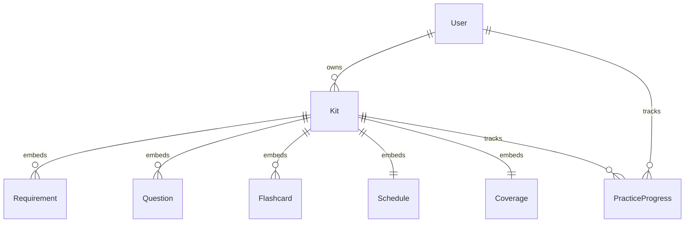

# Database Architecture & Data Models
## Trao AI Interview Prep Kit

---

## 1. Database Choice & Strategy

The application uses **MongoDB** with **Mongoose ODM**. 

### 1.1 Architectural Decision: Embedded vs. Relational Collections
In MongoDB, a fundamental design decision is whether questions, flashcards, and schedule items should live in separate collections or be embedded directly inside the `Kit` document.

**Chosen Strategy: Fully Embedded Within `Kit` Document with Sub-document Identifiers**

#### Rationale & Trade-offs:
1. **Atomicity & Transactional Integrity**: An interview prep kit is inherently a cohesive, bounded aggregate. When generating, regenerating, or exporting a kit (including during CLI batch evaluation), the kit must be retrieved and validated as a single atomic snapshot conforming to Appendix A.
2. **Deterministic Versioning & Serialization**: Serializing an embedded document to the strict Appendix A JSON format requires zero joins/lookups, ensuring extremely fast queries and zero foreign key mismatch bugs.
3. **Edit & Pin State Localization**: Storing question/flashcard edit flags directly on the embedded sub-document (`is_edited`, `is_pinned`, `is_custom`) allows seamless in-place updates and selective section regeneration in a single atomic database write.
4. **Practice Progress Separation**: User flashcard study history (`PracticeSession` / `PracticeCardState`) is modeled as a dedicated sub-document or small referenced collection to isolate high-frequency practice writes from structural kit revisions.

---

## 2. Data Models (Conceptual Schemas)



---

### 2.1 `User` Model
Represents an authenticated user who owns prep kits.

```typescript
interface IUser {
  _id: string; // ObjectId
  email: string; // Unique, normalized lowercase
  passwordHash: string; // bcrypt hash (min 10 salt rounds)
  name?: string;
  createdAt: Date;
  updatedAt: Date;
}
```

---

### 2.2 `Kit` Model (Master Aggregate Document)
The root document representing a generated or edited interview prep kit.

```typescript
interface IKit {
  _id: string; // ObjectId
  userId: string; // Owner User ObjectId (indexed)
  
  // Generation & Pipeline Metadata
  status: "pending" | "crawling" | "generating" | "completed" | "failed";
  progressMessage?: string;
  errorMessage?: string;

  // Strict Appendix A Structure Fields
  source: {
    company: string;
    company_url: string;
    role: string;
    location: string;
    jd_chars: number;
    researched_at: string; // ISO 8601 string
    pages_used: string[];
  };

  company_brief: {
    summary: string;
    what_they_do: string;
    sources: string[];
    // State flag
    is_edited?: boolean;
  };

  role: {
    title: string;
    seniority: string;
    responsibilities: string[];
    requirements: IRequirementItem[];
  };

  questions: IQuestionItem[];
  flashcards: IFlashcardItem[];

  schedule: {
    days_available: number;
    days: IScheduleDayItem[];
    // State flag
    is_edited?: boolean;
  };

  coverage: {
    uncovered_requirement_ids: string[];
    passes: number;
  };

  // Timestamps
  createdAt: Date;
  updatedAt: Date;
}
```

---

### 2.3 Embedded Sub-Document Schemas

#### `IRequirementItem`
```typescript
interface IRequirementItem {
  id: string; // "r1", "r2", ... (stable ID)
  text: string;
  kind: "technical" | "behavioural" | "domain";
  priority: "must" | "nice";
  // Builder state
  is_custom?: boolean;
  is_edited?: boolean;
}
```

#### `IQuestionItem`
```typescript
interface IQuestionItem {
  id: string; // "q1", "q2", ... (stable ID)
  requirement_ids: string[]; // e.g. ["r1", "r3"]
  category: "technical" | "behavioural" | "system-design" | "company-fit";
  prompt: string;
  answer_outline: string;
  difficulty: 1 | 2 | 3;
  
  // Builder State Flags (Critical for Section Regeneration)
  is_custom?: boolean; // Added manually by user
  is_edited?: boolean; // Modified by user after AI generation
  is_pinned?: boolean; // Pinned by user to prevent regeneration
  order?: number;      // Position within category/kit
}
```

#### `IFlashcardItem`
```typescript
interface IFlashcardItem {
  id: string; // "f1", "f2", ... (stable ID)
  front: string;
  back: string;
  requirement_ids: string[];
  
  // Builder State Flags
  is_custom?: boolean;
  is_edited?: boolean;
}
```

#### `IScheduleDayItem`
```typescript
interface IScheduleDayItem {
  day: number; // 1, 2, ...
  focus: string;
  question_ids: string[]; // References existing Question.id
  minutes: number; // Integer minutes
}
```

---

### 2.4 `PracticeProgress` Model
Tracks user engagement, confidence levels, and spaced repetition intervals for flashcards.

```typescript
interface IPracticeProgress {
  _id: string; // ObjectId
  userId: string; // User ObjectId
  kitId: string;  // Kit ObjectId
  
  cardStates: {
    flashcardId: string; // "f1", "f2"
    confidence: "again" | "hard" | "good" | "easy" | null; // Review rating
    reviewCount: number;
    lastReviewedAt: Date | null;
    nextReviewDue: Date | null;
  }[];
  
  totalCards: number;
  reviewedCardsCount: number;
  lastSessionAt: Date;
  createdAt: Date;
  updatedAt: Date;
}
```

---

## 3. Database Indexes

| Collection | Fields | Index Type | Purpose |
| :--- | :--- | :--- | :--- |
| `users` | `email` | Unique | Fast lookup & prevents duplicate user registration |
| `kits` | `userId`, `createdAt` | Compound | Fast retrieval of user kit lists ordered by date |
| `kits` | `_id`, `userId` | Compound | Secure kit lookup enforcing ownership boundary |
| `practice_progress` | `userId`, `kitId` | Unique Compound | Fast retrieval of user practice state per kit |
