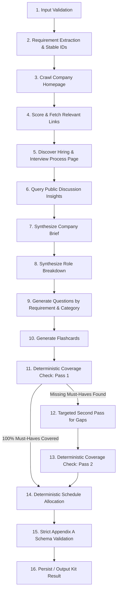

# Generation Pipeline & Sequencing Specification
## Trao AI Interview Prep Kit

---

## 1. Pipeline Principles

> [!IMPORTANT]
> **No Single-Prompt Generation**: The interview prep kit is synthesized through a sequence of deliberate, verified steps that respond dynamically to what is actually retrieved from the company site and job description.
> Two of these steps are **purely deterministic**:
> 1. **Coverage verification** (code set comparison).
> 2. **Schedule day allocation** (mathematical distribution).

---

## 2. Complete 16-Step Pipeline Flow

---

## 3. Detailed Step-by-Step Specification

### Step 1: Input Validation
- **Action**: Validate `jd` text, `company_url`, and `days` integer range ($1 \le \text{days} \le 60$).
- **Engine**: Deterministic code (Zod schema).
- **Output**: Cleaned input parameters.

### Step 2: Requirement Extraction & Stable ID Assignment
- **Action**: Parse the JD to identify role requirements.
- **Engine**: Targeted LLM prompt.
- **Post-Processing (Deterministic)**: Assign sequential stable IDs (`r1`, `r2`, `r3`, ...) to requirements. Classify each as `technical`, `behavioural`, or `domain` with priority `must` or `nice`.
- **Constraint**: Do not hallucinate or invent requirements absent from the JD. Thin stubs produce a compact requirement list honestly.

### Step 3: Crawl Company Homepage
- **Action**: Fetch HTML of `company_url`. Respect `robots.txt`, follow redirects, handle timeouts.
- **Engine**: Deterministic HTTP client + Cheerio parser.
- **Output**: Cleaned homepage text + extracted internal link URLs.

### Step 4: Score & Fetch Top Links
- **Action**: Link ranking heuristic scores URLs matching keywords (`careers`, `jobs`, `about`, `culture`, `engineering`, `handbook`, `interview`).
- **Engine**: Deterministic URL ranker.
- **Output**: Top 2–3 most relevant internal pages fetched and sanitized.

### Step 5: Discover Hiring Process Page
- **Action**: Check if any fetched page details interview stages (e.g. take-home test, system design round, culture interview).
- **Engine**: Deterministic regex/classifier + LLM summarization.
- **Output**: `hiring_process_context` (or empty string if none found; never fabricated).

### Step 6: Query Public Discussion Insights
- **Action**: Check public discussion heuristics / known hiring patterns for the company.
- **Output**: Public interview insights summary.

### Step 7: Synthesize Company Brief
- **Action**: Summarize what the company does, their mission, and hiring style using only retrieved content.
- **Engine**: Targeted LLM prompt.
- **Output**: `company_brief` conforming to Appendix A.

### Step 8: Synthesize Role Breakdown
- **Action**: Structure role title, seniority level, core responsibilities, and the validated requirement list.
- **Engine**: Code synthesis of Step 2 + JD context.

### Step 9: Categorized Question Generation
- **Action**: Generate questions in distinct batches per category:
  - `technical`: Prompts generated against technical requirements.
  - `behavioural`: Prompts generated against behavioural/mentorship requirements.
  - `system-design`: Prompts generated for architecture/seniority requirements.
  - `company-fit`: Prompts tailored to company culture and hiring context.
- **Engine**: Staged LLM calls per category.
- **Output**: Array of `KitQuestion` objects with assigned stable IDs (`q1`, `q2`, ...), `requirement_ids` references, difficulty ($1..3$), and `answer_outline`.

### Step 10: Flashcard Generation
- **Action**: Create flashcards mapping directly to key technical and domain requirement IDs.
- **Engine**: Targeted LLM prompt.
- **Output**: Array of `KitFlashcard` with stable IDs (`f1`, `f2`, ...).

### Step 11: Deterministic Coverage Check (Pass 1)
- **Action**: Check if every `must` requirement ID is referenced in at least one question's `requirement_ids`.
- **Engine**: Pure deterministic code:
  $$\text{coveredIds} = \bigcup_{q \in \text{questions}} q.\text{requirement\_ids}$$
  $$\text{uncoveredMustIds} = \{ r.\text{id} \mid r.\text{priority} = \text{"must"} \} \setminus \text{coveredIds}$$
- **Condition**: If $\text{uncoveredMustIds} = \emptyset$, proceed to Step 14. If non-empty, proceed to Step 12.

### Step 12: Targeted Second-Pass Loop for Gaps
- **Action**: Send a targeted prompt to the LLM providing *only* the uncovered requirement texts, instructing it to generate targeted questions covering those exact requirement IDs.
- **Engine**: Targeted LLM call.
- **Output**: Supplementary questions assigned new IDs (`q_gap1`, `q_gap2`, ...), mapped to the missing requirement IDs.

### Step 13: Deterministic Coverage Check (Pass 2)
- **Action**: Re-run the coverage check. Set `coverage: { uncovered_requirement_ids: [...], passes: 2 }`.
- **Engine**: Pure deterministic code.

### Step 14: Deterministic Schedule Allocation
- **Action**: Distribute all questions across exactly `days_available` ($D$).
- **Engine**: Mathematical allocation algorithm in application code (see below).
- **Rules**:
  - Exactly $D$ days generated.
  - Every must-have requirement appears in the schedule.
  - Harder / foundational topics scheduled earlier (Days 1–2); review and company-fit scheduled later (Days $D-1$, $D$).
  - Calculate `minutes` as integer sum based on difficulty ($1 = 15\text{m}, 2 = 25\text{m}, 3 = 45\text{m}$).

### Step 15: Strict Appendix A Schema Validation
- **Action**: Validate entire output object against Zod `KitStructureSchema`.
- **Engine**: Runtime validation.
- **Output**: Verified valid kit object or formatted error.

### Step 16: Persist & Return
- **Action**: Save to MongoDB (for web app) or serialize to JSON (for CLI evaluator).
