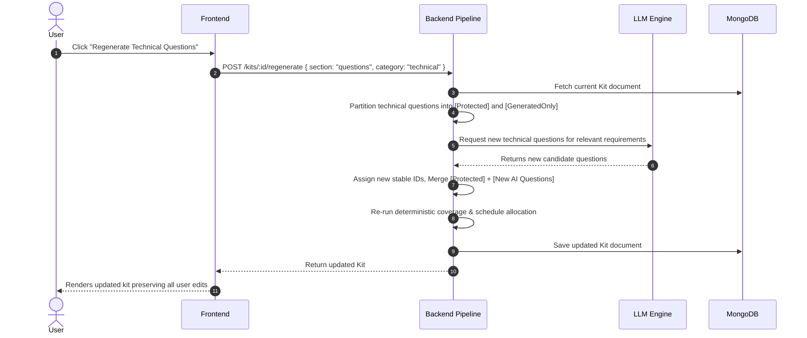

# State Preservation & Regeneration Strategy
## Trao AI Interview Prep Kit

---

## 1. The Core Problem

When users interact with an AI-generated kit:
1. They may tweak a generated question's prompt or answer outline.
2. They may write their own custom questions from scratch.
3. They may explicitly pin a high-priority question.
4. They may subsequently click **"Regenerate Technical Questions"** or **"Regenerate Company Brief"**.

> [!IMPORTANT]
> **Strict Requirement**: Regenerating one section/category must **NEVER discard or clobber** user edits, custom questions, or pinned items in that category or elsewhere in the kit.

---

## 2. State Representation Model

Each entity in the kit (Question, Flashcard, Requirement, Brief) tracks three explicit Boolean flags:

| State Flag | Type | Meaning | Set When |
| :--- | :---: | :--- | :--- |
| `is_custom` | `boolean` | Created by the user by hand (not generated by AI). | User clicks "Add Question" or "Add Flashcard". |
| `is_edited` | `boolean` | Originally AI-generated, but modified by the user. | User alters prompt, outline, front, back, etc. |
| `is_pinned` | `boolean` | Explicitly marked to be locked and immune to regeneration. | User clicks the "Pin / Lock" toggle button. |

An item is considered **Protected** if:
$$\text{isProtected} = \text{is\_custom} \lor \text{is\_edited} \lor \text{is\_pinned}$$

---

## 3. Section Regeneration Lifecycle

When a user triggers regeneration for a specific target (e.g. `category: "technical"`):



---

## 4. Exact Merge Algorithm (Deterministic)

```typescript
/**
 * Merges newly generated questions with existing protected questions in a category.
 */
function mergeQuestionsOnRegenerate(
  existingQuestions: IQuestionItem[],
  newAiQuestions: IQuestionItem[],
  targetCategory: QuestionCategory
): IQuestionItem[] {
  // 1. Separate questions outside the target category (untouched)
  const otherCategoryQuestions = existingQuestions.filter(
    (q) => q.category !== targetCategory
  );

  // 2. Extract protected questions in the target category (user edited/created/pinned)
  const protectedCategoryQuestions = existingQuestions.filter(
    (q) => q.category === targetCategory && (q.is_edited || q.is_custom || q.is_pinned)
  );

  // 3. Find highest existing numeric ID index to prevent ID collisions (e.g. "q7")
  let maxIdNum = existingQuestions.reduce((max, q) => {
    const num = parseInt(q.id.replace(/^q/, ""), 10);
    return isNaN(num) ? max : Math.max(max, num);
  }, 0);

  // 4. Assign new unique sequential IDs to newly generated questions
  const reindexedNewQuestions = newAiQuestions.map((q) => {
    maxIdNum += 1;
    return {
      ...q,
      id: `q${maxIdNum}`,
      category: targetCategory,
      is_custom: false,
      is_edited: false,
      is_pinned: false,
    };
  });

  // 5. Combine preserved protected questions with new generated questions
  const combinedCategoryQuestions = [
    ...protectedCategoryQuestions,
    ...reindexedNewQuestions,
  ];

  // 6. Return full question list
  return [...otherCategoryQuestions, ...combinedCategoryQuestions];
}
```

---

## 5. Reordering & Category Moving

- When a user moves a question from `technical` to `system-design`, its `category` field is updated and `is_edited: true` is set.
- If the user subsequently regenerates the `technical` category, that question is safe because it is now in `system-design` and flagged as `is_edited`.
- Reordering maintains an explicit `order` index so the user's visual sequence is strictly preserved.

---

## 6. Appendix A Serialization Guarantee

While the internal MongoDB document retains `is_edited`, `is_pinned`, and `is_custom` for builder features, the external serializer (`toAppendixAKit(kit)`) cleanses any internal meta-properties, producing a 100% compliant Appendix A object for both API consumers and the batch evaluation CLI.
